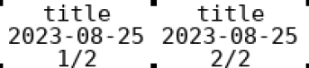

# ptouch-label

A simple script in Babashka to print beautiful labels with label printers like a ptouch (the script could easily be adjusted to other devices).



# Requirement


To run this script, you will need to install the following dependencies on a Debian-based system:

``` 
sudo apt install cutycapt
sudo apt install imagemagick
```
Build ptouch-print (installing from package manager may work properly) 

```

# Download, build and install ptouch-print if not already installed
sudo apt install libgd-dev gettext cmake libusb-1.0-0-dev
git clone https://git.familie-radermacher.ch/linux/ptouch-print.git
cd ptouch-print
./build.sh
ls -l build/ptouch-print 
build/ptouch-print --version
prefix=$HOME/software/ptouch-print
mkdir -p "$prefix"/{bin,share/man/man1}
cp build/ptouch-print "$prefix/bin/"
cp ptouch-print.1 "$prefix/share/man/man1"
sudo chmod u+s "$prefix/bin/ptouch-print"
sudo chown root "$prefix/bin/ptouch-print"

```

# Install

To install the script, follow these steps:
``` 
# Install

sudo cp build/ptouch-print /bin/

# You may need to do the following to have ptouch-print in env variable between sessions. You can remove zshenv (and/or bash) or change accordingly to your shell.
sudo echo "prefix=$HOME/software/ptouch-print" | tee -a ~/.zshenv ~/.bashrc
sudo echo "PATH=$prefix/bin:$PATH" | tee -a ~/.zshenv ~/.bashrc
sudo echo "MANPATH=$prefix/share/man/man1:$MANPATH" | tee -a ~/.zshenv ~/.bashrc

```

# How to use

The script comes with three preconfigured templates:

- food-label
- chain

## Template System

Templates define how text is arranged on your labels. There are two pre-made templates:
- `food-label`: Prints a title, date, and label number (template: "t1 d n")
- `chain`: Prints a list of items, one per label (template: "l1")

### Template Arguments

1. **Fixed Text (`t#`)**
   - Use `-t1`, `-t2`, etc. for text that appears on every label
   - Example: `-t1 "Hello" -t2 "World" --template "t1 t2"`

Label 1: Label 2: Label 3:
Hello Hello Hello
World World World

2. **List Text (`l#`)**
   - Use `-l1`, `-l2`, etc. for lists of items (separated by commas)
   - Example: `-l1 "Apple, Banana, Orange" --template "l1"`

Label 1: Label 2: Label 3:
Apple Banana Orange

3. **Special Variables**
   - `i`: Label number (1, 2, 3...)
   - `n`: Label fraction (1/3, 2/3, 3/3)
   - `d`: Current date (YYYY-MM-DD)

### Layout Control

- Space (" "): Start new line
- Dot ("."): Continue on same line

### Complete Example

```bash
-t1 "Product" -l1 "Red, Blue, Green" --template "t1.i l1 n d"

```

Produces:

| Label 1 |   Label 2 |   Label 3 | 
----
| Product 1 |  Product 2 |  Product 3 | 
| Red |       Blue |      Green | 
| 1/3 |       2/3 |       3/3 | 
| 2025-01-14 | 2025-01-14 | 2025-01-14 | 


# Test


``` 
bb --nrepl-server
```
 Then cider-connect to port.

# TODO

- Add and test more os installation
- Replace package from package manager for node packages
- Check if building ptouch-print is still necessary
